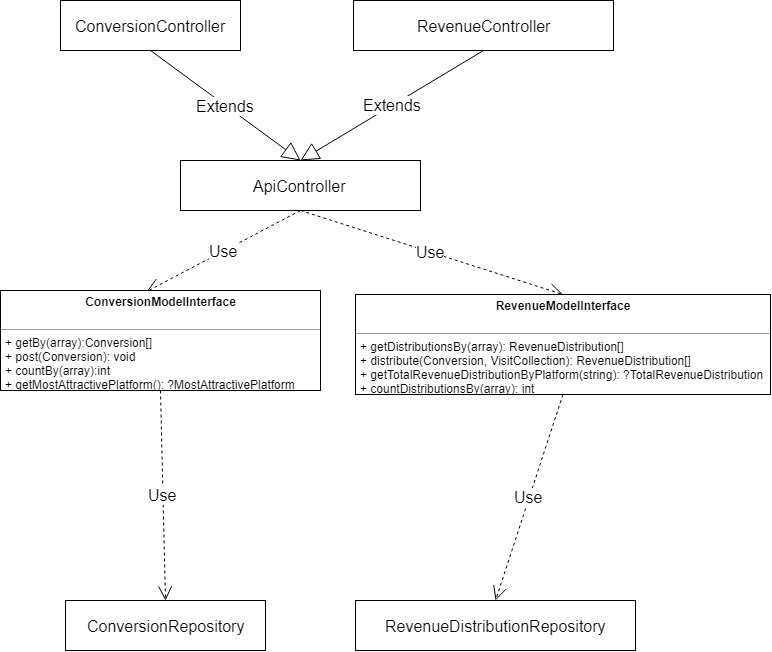

# Development
## Run application

In order to start the application for manual testing, do the following steps:
 
- start the web server by running command:
    -`docker-compose up -d webserver`
- install composer dependencies
    - `docker-compose exec app composer install --no-interaction`
- build DB tables
    - `docker-compose exec app php bin/console doctrine:migrations:migrate`
    - type `y` on prompt
- import fixtures
    - `docker-compose exec app php bin/console doctrine:fixtures:load`
    - type `yes` on prompt
- open in browser:
    - `localhost:8888`

## Stop application

Run command `docker-compose down --remove-orphans`


## Run automated tests:

**Important**
For convenience reasons, it is necessary to follow the steps in "run application" in order to run the tests

run command `docker-compose up tests```


# Test manually

## Add a new conversions

- call GET /conversions/new with valid parameters to create a new conversion
- call GET /conversions and find the conversion in the response
- the conversion will have a link to the revenue distributions
- use that link to fetch the distribution resources
- distribution resource will provide a link to get total revenue distributed by platform
- call that link to fetch the information


# Documentation

## Classes


## Database


## Distribution model

- Rules:
    - 1st visited platform receives 45% of amount
    - last visited platform receives 35% of amount
    - the other visited platforms receive 25% of amount equally distributed by them
    - If there is only one visited platform, it will get all
    - If there are two platforms:
        - 1st visited platform receives 55% of amount
        - last visited platform receives 45% of amount      
- Class: RevenueDistributionModel
- Repository: RevenueDistributionRepository
